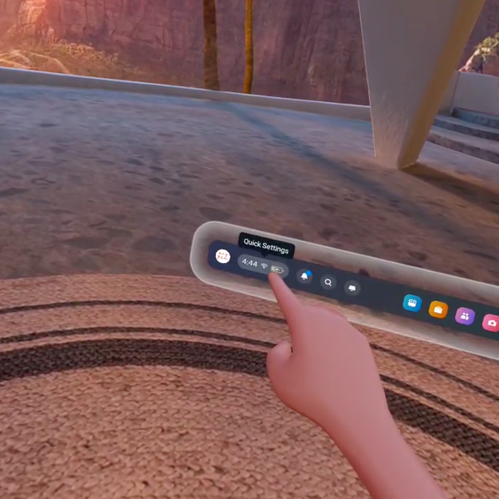
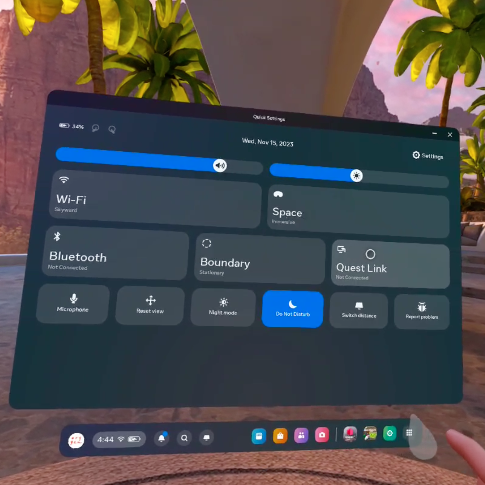
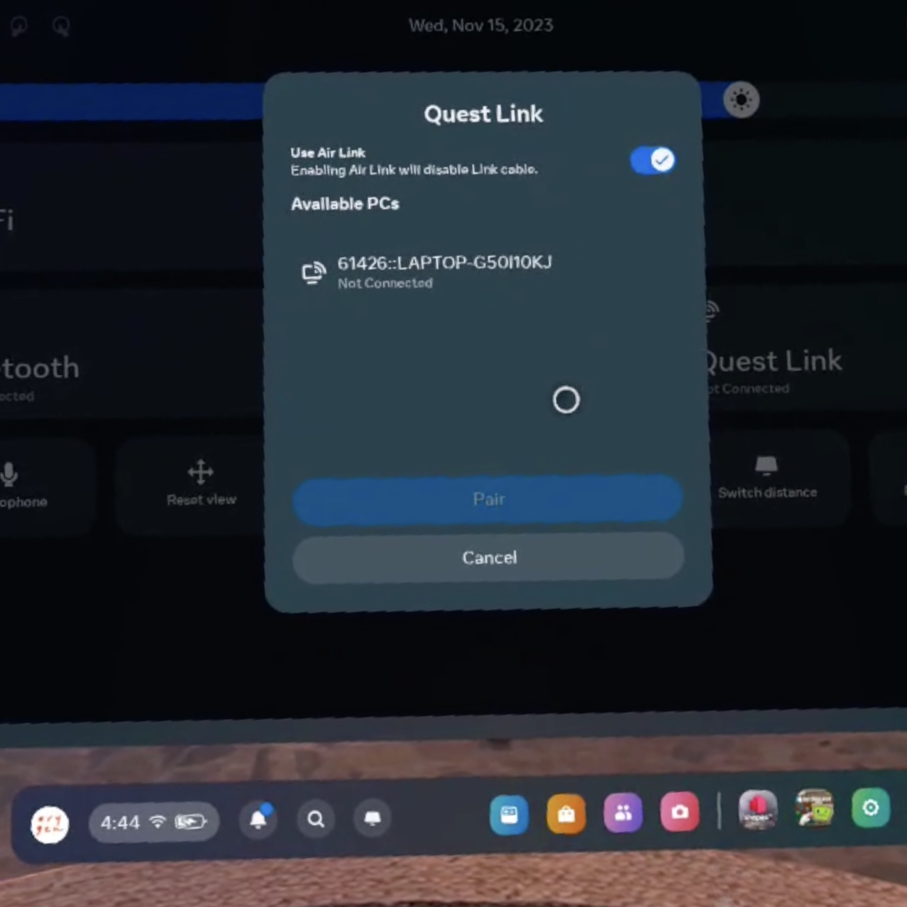
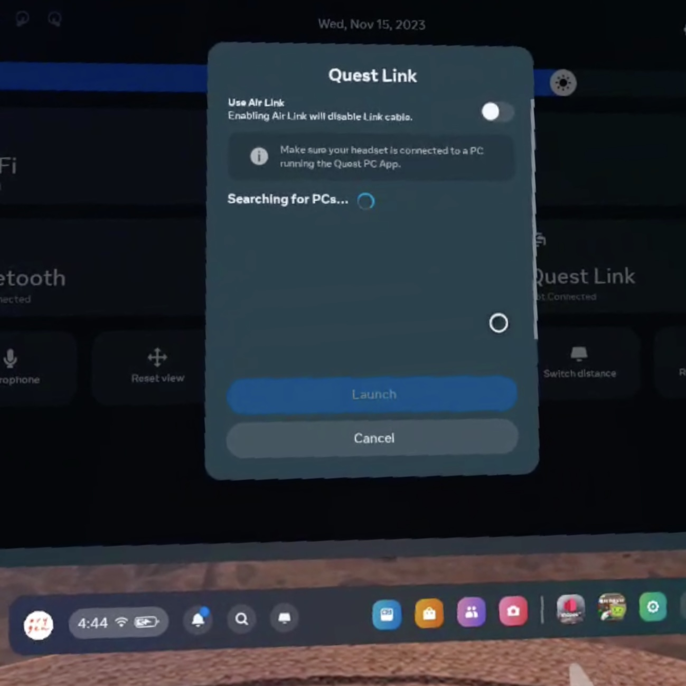
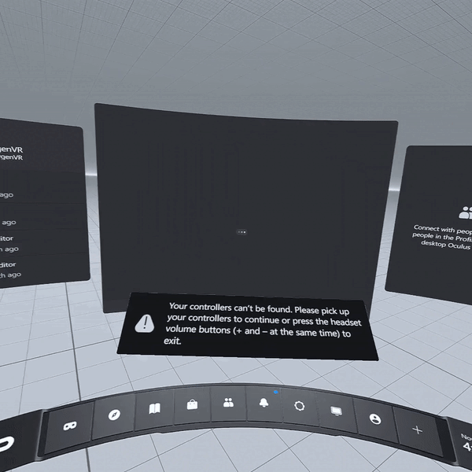

# Revive User Guide

  

## Introduction
Revive is a novel virtual reality (VR) therapy designed to help young people overcome social anxiety and improve their social interaction skills. By creating immersive, realistic social scenarios in a VR setting, Revive allows individuals to practice and gain confidence in situations they find challenging, such as conversations in a cafe or interactions on public transport. This personalized and interactive approach, guided by therapists, offers a safe and controlled environment for users to develop social skills, making it a valuable complement to traditional therapeutic methods.

## Table of Contents
- [Minimum Requirements](#minimum-requirements)
- [Installation](#installation)
- [Getting Started](#getting-started)
- [Features](#features)
- [Usage Instructions](#usage-instructions)
- [Troubleshooting](#troubleshooting)
- [FAQ](#faq)
- [Support](#support)
- [License](#license)

## Minimum Requirements
To ensure the best experience with Revive, the following minimum requirements should be met:

### Meta Quest 2 or 3:
- Meta Quest 2 or 3 headset with the latest firmware update.
- Usb-c Link Cable [meta](https://www.meta.com/au/quest/accessories/link-cable/) or 5Ghz Wifi 

### For PC :
- Operating System: Windows 10, Windows 11.
- Processor: Intel i5-4590/AMD Ryzen 5 1500X or greater
- Memory: 8 GB+ RAM.
- Graphics Card: NVIDIA GTX 1060 / AMD Radeon RX 480 or greater. [More Info](https://www.meta.com/en-gb/help/quest/articles/headsets-and-accessories/oculus-link/meta-quest-link-compatibility/)
  

## Installation

1. Ensure your Oculus Quest 2 or 3 is updated to the latest firmware.
2. Install the Oculus App on your PC. [Download here](https://www.oculus.com/download_app/?id=1582076955407037)

3. Open Oculus App, en the left menu click on Devices, then click on Add Headset.
4. Select your headset. 

  <video width="80%" controls>
  <source src="docs/Images/Revive_Pair_AirLink.mp4" type="video/mp4">
</video>

For cable Connection:
- Connect your headeset with the usb-c cable to your computer.

For wireless connection
- Connect your Oculus Quest and your PC to the same wifi network.

5. Open Oculus App on the PC and follow instructions to pair.
6. Put on your headset. Once connected, you should see a prompt in VR asking if you want to enable AirLink. Choose “Enable” to initiate the connection. If you don’t see the prompt, you can navigate to the Settings menu in your Quest and manually enable AirLink.

6. The computer and headset are connected when the user in the headset is in a white room.

## Getting Started
Instructions on how to set up and start using the program for the first time.
1. Connect your Meta Quest using cable or wifi (Airlink)
  - For cable make sure to use a USB-c fast speed cable
  - For airlink make sure the headset and the computer are in the same Wifi network 

2. Put in the headset and click on Quick Settings

  

3. Select Quest Link

  

4. For Wifi tick on "Use Air Link", for cable tick off.

  <h2> Wireless Setup </h2>
  

  <h2> Cable Setup </h2>
  

2. Select computer and click on "Launch"
3. The user in the headset shoudl be in the White space:

  

4. In your computer doble click on the Revive Icon to start the program.

  

## Features
List and describe the key features of the program.
- Feature 1: Select Different Enviroments
- Feature 2: Create Social Interactions
- Feature 3: Control Avatar Emotions and Attention
- Feature 4: Control Avatar Voice

## Usage Instructions
Detailed guidance on how to use the program, ideally with examples.
1. [Step-by-step instruction on how to use a specific feature]
2. [Additional instructions or tips for using the program]
(Note: Provide detailed examples for each key feature.)

## Troubleshooting
Common issues and their solutions.
- Issue: AirLink connection is unstable.
  Solution: Check your Wi-Fi connection and ensure your PC and headset are on the same network.

  [Visit Meta support for Airlink ](https://www.meta.com/en-gb/help/quest/articles/headsets-and-accessories/oculus-link/connect-with-air-link/)
https://www.meta.com/en-gb/help/quest/articles/headsets-and-accessories/oculus-link/air-link-benchmark/
  
  
- Issue: [Another common issue]
  Solution: [Solution]

## FAQ
Answer common questions users might have about the program.
Q1: Do I need an internet connection to use [Your Program Name]?
A1: Yes, an active internet connection is required for using AirLink.

Q2: Can I use [Your Program Name] with other VR headsets?
A2: Currently, [Your Program Name] is only compatible with Oculus Quest 2 and 3.

## Support
Information on how to get further help.
For further assistance, please contact our support team at [support email/contact form] or visit our website [website link].
